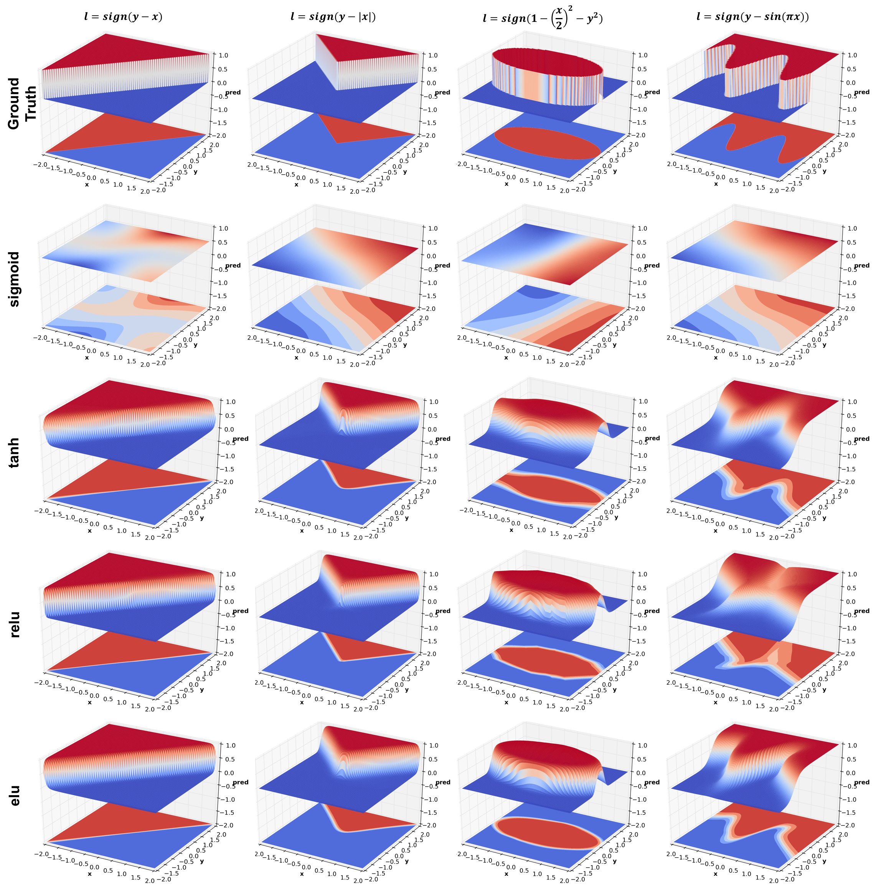

# Easily visualize the effects of neural network architectural choices on 2D data

The code allows you to easily visualize the prediction surface of any neural network for any 2D data. This was written partially for generating results for [one of my blog posts](http://ahumaninmachinesworld.blogspot.in/2016/12/visualizing-effects-of-neural-network.html). But in addition I have tried to make it easy to try out various tweaks, either your own or one of the many published on arXiv, for improving training and data efficiency of neural networks.

# Example

The following result compares the effect of different activations - `sigmoid`, `tanh`, `relu`, and `elu`, on learning 4 different decision functions. 


# Dependencies

- Tensorflow 0.12
- Numpy
- Matplotlib
- [pyAIUtils](https://github.com/BigRedT/pyAIUtils)

# Setup

Install all the above dependencies except pyAIUtils. Clone the repository and run the following commands inside the created directory to setup pyAIUtils which is used as submodule.
```
git submodule init
git submodule update
```
After running these commands, make sure the pyAIUtils directory is created and has aiutils directory inside it.

# Code Overview

See nn_pred_surf/experiments directory for example scripts. Each of these scripts uses the `Constants` class to store network specifications. An object of this class is passed on to `run_experiments.run()` which [samples data](./data), [creates a tensorflow computation graph](./graph.py), [trains the network](./train.py) and [produces a decision surface](./visualizers).

# Usage

Feel free to use the code and any material on the [blog](http://ahumaninmachinesworld.blogspot.in/2016/12/visualizing-effects-of-neural-network.html) as long as you attribute it correctly. For publications you may use the following BibTex citation
```
@misc{gupta2016nnpredsurf,
  author = {Gupta, Tanmay},
  title = {Visualizing the effects of neural network architectural choices},
  year = {2016},
  howpublished = {http://ahumaninmachinesworld.blogspot.in/2016/12/visualizing-effects-of-neural-network.html}
}
```

Have fun visualizing!